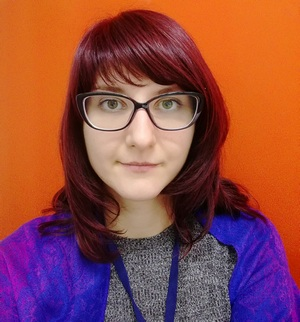

# Кратко обо мне

### Меня зовут Екатерина.

Я 10 лет работала *бухгалтером*. Сейчас хочу стать **_инженером по тестированию_**.

На данный момент обучаюсь в **Нетологии** на курсе "Тестировщик ПО".

### В свободное время мне нравится:
{list-style-position : inside;}

- Путешествовать
- Слушать музыку
- Вышивать
- Изучать что-нибудь новое
- Играть с котиками (их целых 3 штуки) 